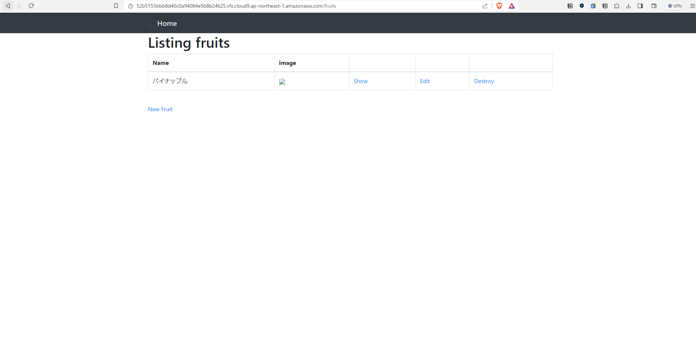
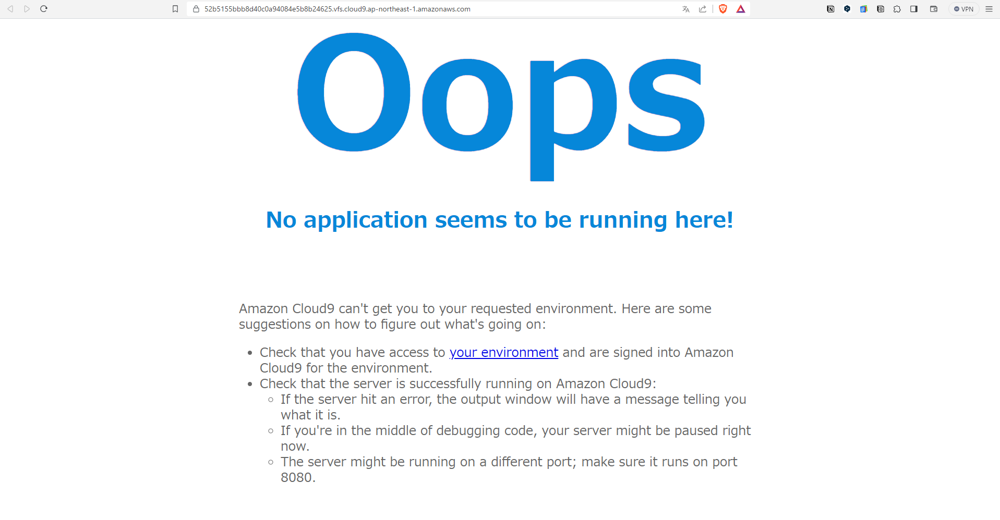
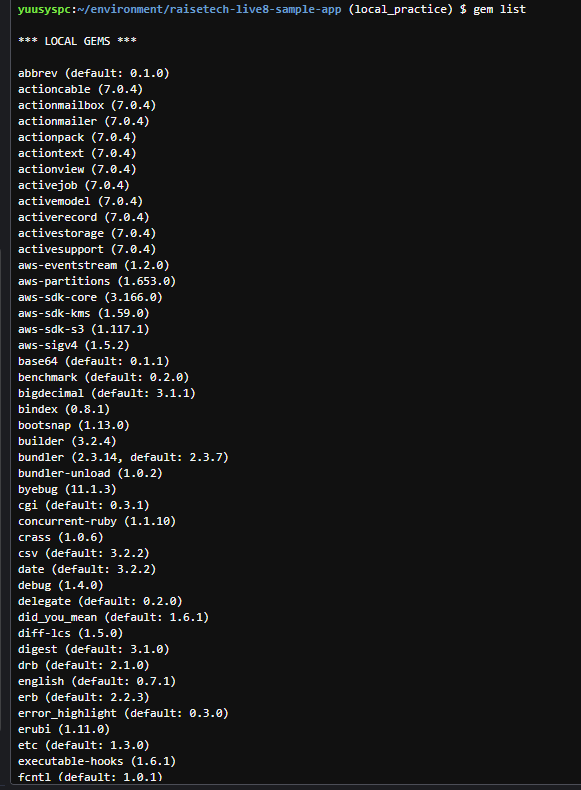

# AWSフルコース第三回課題について

## サンプルアプリをCloud9上で起動する

**実施手順**

1. サンプルアプリのリポジトリを自身のGitHubへforkして、Cloud9でgit cloneを実施
2. リポジトリ内に移動したところ```Required ruby-3.1.2 is not installed.To install do: 'rvm install "ruby-3.1.2"'```と表示されたためrubyバージョンを確認
3. rubyバージョンが3.0.6のため```rvm install "ruby-3.1.2"```を実行
4. サンプルアプリのReadmeを読んでbin/setupを実行
5. An error occurred while installing mysql2 (0.5.4), and Bundler cannot continue.で失敗
6. AWSコースのNotionページのMySQLセットアップを閲覧して実施
7. SQL内に入れたので初期パスワードを変更
8. リポジトリに戻って再度bin/setupを実行。== Command ["bin/yarn"] failed ==と表示され失敗
9. ```npm install```と```npm install --global yarn```を実施
10. yarnが入っていることを確認後再度bin/setup実施。== Command ["bin/rails db:prepare"] failed ==と表示され失敗
11. config/database.ymlファイルのmysql2接続設定のパスワードを変更していなかったのでその部分を変更
12. 環境変数を利用するため、Gemfileにgem 'figaro'を追加。bundle install→bundle exec figaro install
13. 生成されたconfig/application.yml内にmysql2のパスワードを定義して、ファイルを.gitignoreに追加
14. 再度実行を試したところ、Can't connect to local MySQL server through socket '/tmp/mysql.sockというエラーで失敗
15. mysql_config --socketでsocketの位置を確認。database.ymlの記載が違うので差し替え
16. 再度実行を試したところエラー内容が変化。今度はBlocked host:～というエラーで失敗
17. config/environments/development.rb内にconfig.hosts <<　"～"を追記
18. またエラー内容が変化。The asset "〜" is not present in the asset pipeline.
19. rake tmp:cache:clearでキャッシュのクリア、rake assets:precompileで再コンパイルしたところエラーの解消
20. 再度実行すると表示が接続が拒否されましたと出たが、プレビュー右上のボタンをクリックしてアプリの表示に成功

## APサーバーについて

#### アプリケーションサーバーとは
WEB3層構造のと呼ばれるWebシステムで、アプリケーションのプログラムを動作させるためのサーバ。
Webサーバーから要求を受けてプログラムを実行したり、必要に応じてDBサーバへの問い合わせや書き込み処理をし、処理結果をWebサーバへ提供する役割。
使用するプログラミング言語によりAPサーバも分かれており、今回のRubyでいうとPumaやUnicornというオープンソースのAPサーバーが利用できる。
今回コマンド```rails s```でBooting Pumaと起動したのがAPサーバー。
この状態でサーバーにアクセスすると下記のようにアプリの動作が確認できる。



サーバーを終了して再度同じようにアクセスをしてもアプリは動作しない。



クライアントからのリクエストが静的コンテンツのみの場合は、APサーバーとWebサーバー間の通信は行わず、Webサーバーのみで処理をする。


## DBサーバーについて

#### データベースサーバーとは
データを一元管理し、データの検索、更新、保存、バックアップを行うサーバのこと。
Web3層構造のWebシステムでは最下層に位置し、APサーバからの要求に基づきデータの検索やデータの更新（追加、修正、削除）を行っている。
DBサーバーはDBMS(データベースマネジメントシステム)を介してデータの更新などを行っている。
いくつかの種類があるが、現在最も普及しているのはリレーショナル型のデータベース管理をするRDBMS。
そしてサーバ上のリレーショナルデータベースを操作するのがSQLという言語。
APサーバーからSQLでDBサーバー内のデータベースを操作することができる。


今回の課題ではMySQLサーバーのVersion 8.0.34を使用した。
ちなみにGemfileに記載しているgem mysql2はDBサーバーのことではなく、RailsがDBサーバーに接続するためのクライアントライブラリ。


## 構成管理ツールについて

#### gemの依存関係の管理を一括して担ってくれるBundler
Railsの開発ではGemというライブラリを使ってアプリを作成していくのが一般的。
そのgemの依存関係の管理を楽にしてくれるツールがBundler。Bundlerもgemの一つ。

 

上図で挙げたgemはほんの一部であり、これらを一つ一つ管理するのは大変。
BundlerはBundle installでGemfileに記載された内容に基づいて、一括でgemのインストールをしてくれる。
そのため、設定ファイルを共有しておくことで、チームで開発する際のそれぞれのローカル環境で差異がでるのを防ぐ。

今回の課題ではBundler version 2.3.14を利用。