# AWSフルコース第四回課題について

## VPCとEC2とRDSの構築
AWSでVPCを立ち上げて、EC2とRDSを構築して接続の確認をする

**VPC作成**
- CIDRブロック(利用できるIPアドレスの範囲)10.0.0.0/24
- AZを二つ作成し、その中にパブリックサブネットとプライベートサブネットを各一つ作成
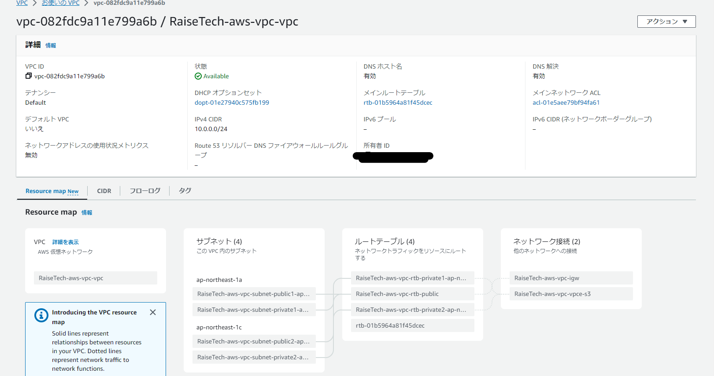  

**サブネット構成の確認**
- サブネットの確認をすると、同じVPCのサブネットの異なるAZに存在する
- vpc(RaiseTech-aws-vpc-vpc)
- AZ1(ap-northeast-1a)
- AZ2(ap-northeast-1c)
- 各AZにパブリックサブネットとプライベートサブネット配置されている

**EC2を作成**
- Vpc(RaiseTech-aws-vpc-vpc) 
- Subnet(RaiseTech-aws-vpc-subnet-public1-ap-northeast-1a) 
- SecurityGroup(Raisetech-firewall)
- AZ1(ap-northeast-1a)内のパブリックサブネットに作成されていることがわかる
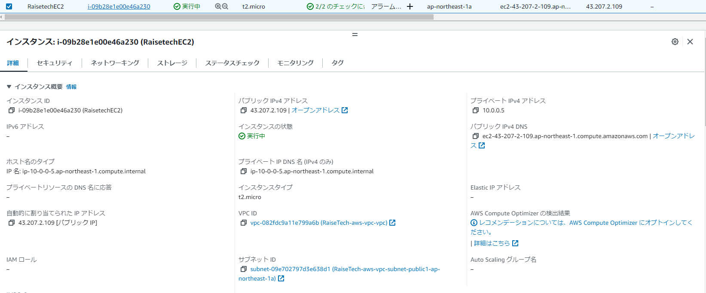
- SecurityGroup(Raisetech-firewall)となっている
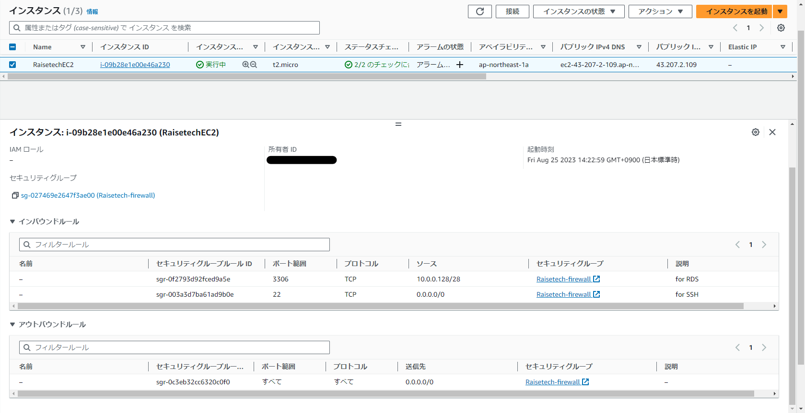

**RDSを作成**
- AZ(ap-northeast-1a)内であることわかる
- SecurityGroup(default)となっている
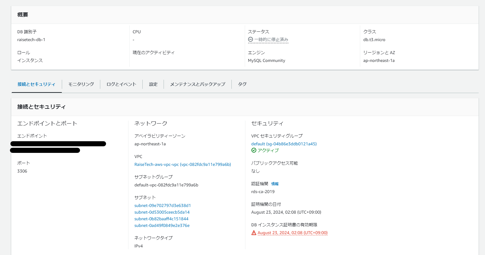
- SubnetGroup(下記のサブネット内に配置が可能である)
    - RaiseTech-aws-vpc-subnet-public1-ap-northeast-1a
        
    - RaiseTech-aws-vpc-subnet-private1-ap-northeast-1a
        
    - RaiseTech-aws-vpc-subnet-public2-ap-northeast-1c
        
    - RaiseTech-aws-vpc-subnet-private2-ap-northeast-1c
        

**セキュリティグループ**
- EC2のセキュリティグループのインバウンドで許可しているMySQLのソースは10.0.0.128/28  
であり、同じAZのプライベートサブネットからの通信を許可している
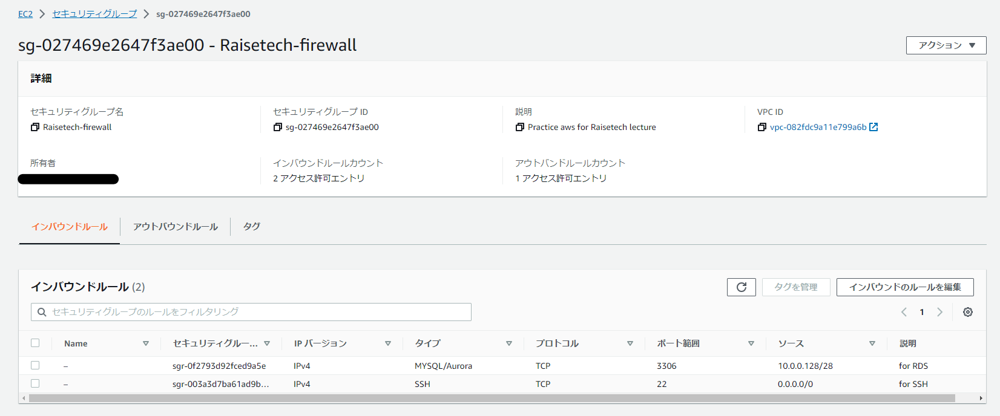
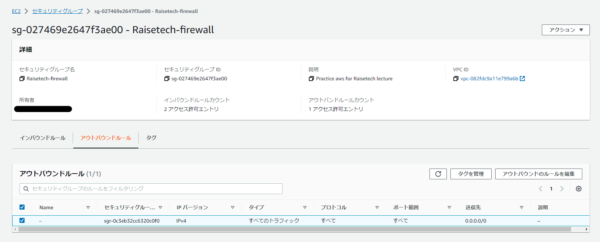
- RDSのセキュリティグループの許可しているインバウンドとアウトバウンドはEC2のセキュリティグループを適用しているソースからの通信を許可している  
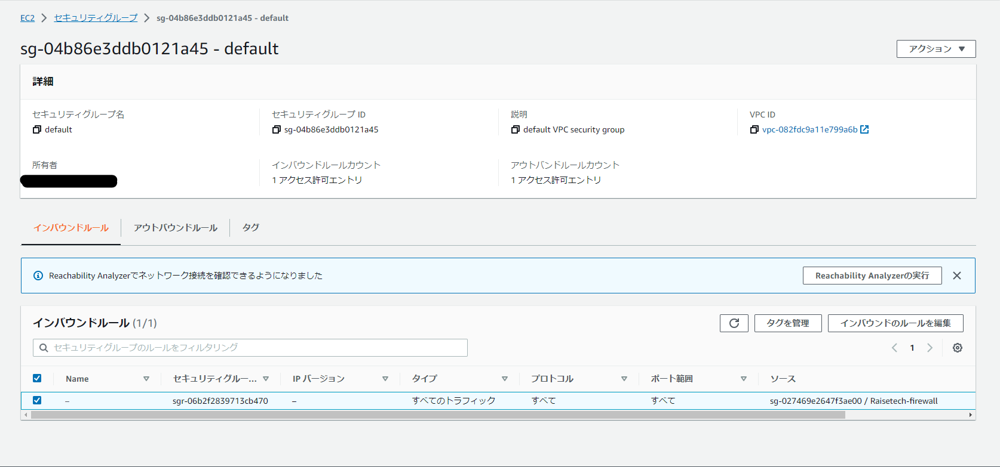
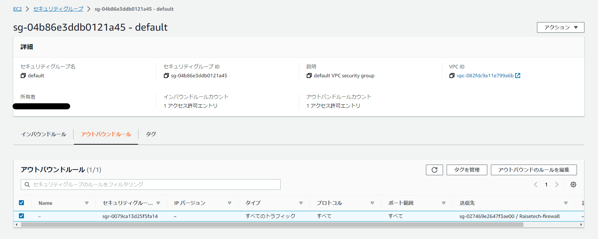

## EC2にアクセスしてRDSに接続できる確認

**TeraTermからEC2にSSH接続してMySQLに接続**
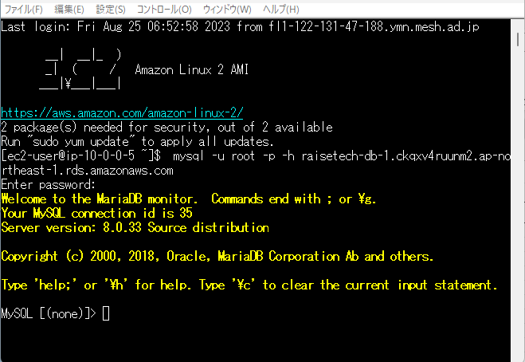

**RDS接続してる状態の確認**
 
**RDS接続を切断した場合の確認**

### 内容の修正と追加で調べたこと
##### 修正箇所
1. EC2セキュリティグループのインバウンドルールからMySQLを削除し、SSH通信のみに変更
   **追記** SSH通信のソースに単一のIPアドレスを指定に変更
2. ルールのソース指定をCIDR指定からセキュリティグループ指定に変更
    **セキュリティグループで指定するメリット**
    - セキュリティグループを指定することにより、そのグループに紐付けられている特定のインスタンスのみにアクセスを許可できる。
    - 動的にIPアドレスが変化したり、IPアドレスの変更があってもルールの更新が必要ない
    - 関連するインスタンスのルールを一元管理し、一貫性が保てる
    - インスタンスが増えた場合に、セキュリティグループを紐付けるだけでよい
    - セキュリティ設定の意図を他のチームメンバーと共有しやすくなる

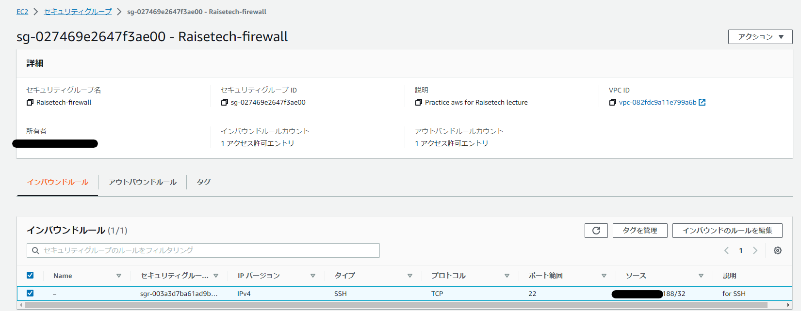

3. RDSのセキュリティルールも同様に最小構成に変更

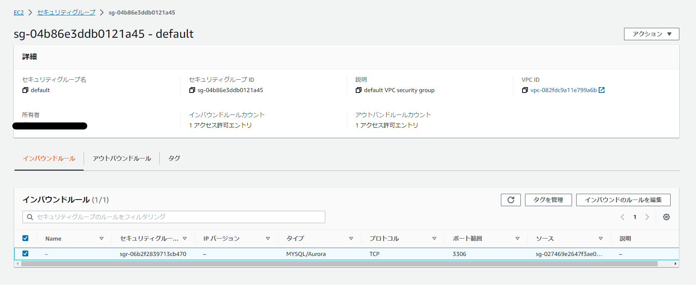

4. RDSが配置できるサブネットグループからパブリックサブネットを削除
    **パブリックサブネットを含めない理由**
    - 仮にパブリックサブネットに配置してしまった場合にセキュリティのリスクが高まる
    - RDSのサブネットグループにパブリックサブネットが存在すると、マルチAZの使用などでRDSが意図せずパブリックサブネットに配置されてしまいセキュリティリスクを高める懸念があるため
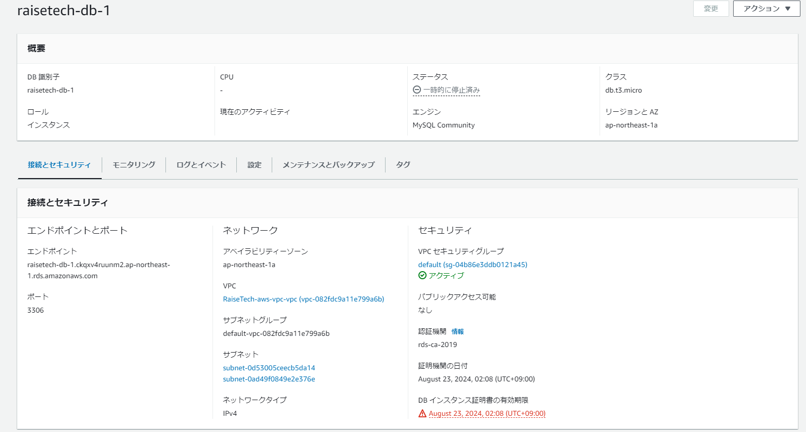 