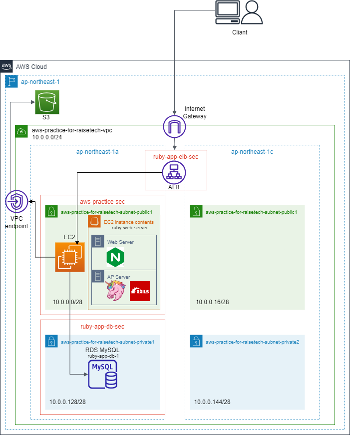

## セキュリティ対策について

---

### 要点

1. **システムのセキュリティ重要性**
    - システムが正常に稼働し続けるためには、インフラの正常性だけでなくセキュリティについても意識する必要がある。  
    - 誤ったパスワードでのログインが可能なシステムや、管理者パスワードがネットで公開されているシステムは誰も使用運用したくない。
2. **セキュリティの基本原則**:
   - 想定されるリスクを洗い出す。
   - リスクに対する対応方針（アクション）を定義する。
     - **受容**: リスクをそのまま受け入れ、特に対策を行わない。
        発生頻度や影響からみて、このままでも良いと判断
     - **低減**: リスクの影響を減少させる対策を実施。
        機密情報を分散して保持するなど、リスクを低減させる策を講じる。
     - **移転（転嫁）**: リスク管理を他者に委ねる。
        外部サービス、例えばAWSのようにデータセンタの管理を外部に委ねる。
     - **回避**: リスクが発生しないような対策を行う。
        そもそもリスクがある手法とは別の方法をとるなど、リスク自体を回避する。
3. **想定されるリスク**:
   - データの盗難、改ざん、破壊。
   - 脆弱性（システムの弱点）。例: log4j2問題。
   - 認証情報の流出。例: GitHubへの誤ったアップロード、IAMアクセスキーの流出。
   - 人為的な過負荷。例: DDoS攻撃。
4. **セキュリティ対策計画の主体**: セキュリティ対策計画の主体はエンジニアではなく、事業責任者であるべき。エンジニアは専門家としての知見を提供する立場。  
  
    **基本的には「すべてのリスクを洗い出すのは不可能（増えるものだから）」「最終判断は事業責任者ですよ」という相手へのインプット、合意は忘れないようにする。**

---

### 専門用語解説

- **脆弱性**: システムやソフトウェアに存在する弱点や不具合。これを利用されると、不正アクセスやデータ流出などのセキュリティインシデントが発生する可能性がある。
- **log4j2問題**: 人気のJavaログライブラリであるlog4j2に存在した脆弱性。この脆弱性を悪用することで、攻撃者は任意のコードを実行することが可能となっていた。
- **IAMアクセスキー**: AWS (Amazon Web Services) の認証情報。これが流出すると、不正なアクセスやリソースの悪用が行われる可能性がある。
- **DDoS攻撃**: Distributed Denial of Serviceの略。多数のコンピューターから目標となるサービスに大量のアクセスを仕掛け、サービスを停止させる攻撃。

---

### AWSでのセキュリティ対策：脆弱性と認証情報の流出

1. **脆弱性対策**
- Webアプリの攻撃手法と対策方法について特に重大なものを、[OWASP](https://owasp.org/)という非営利団体が「OWASP Top 10」としてまとめており、[日本のOWASP団体](https://owasp.org/www-chapter-japan/) でも公開している。
- GitHubでは`Dependabot`というモジュールやライブラリの更新を指摘するBotサービスを無料で使える。
- `CVSS`という脆弱性情報をとりまとめる共通脆弱性評価システムがあり、脆弱性に対しての重要度を設定している。世界中にある脆弱性関連サービスの情報源。日本での`CVSS`データベースは[JVN](https://jvndb.jvn.jp/)。国外だと米国のNISTも[NVD](https://nvd.nist.gov/vuln/search)というデータベースを持っている。

##### AWSはアプリ、OS/ミドルウェア、ネットワークの脆弱性対策をサポートするサービスを提供
- アプリケーション脆弱性
    - `CodeGuru Reviewer`: AIを利用してコードのスキャンを行い、改善提案を行うサービス。        
    - `AWS WAF(Web Application Firewall)`: Webアプリケーションの脆弱性に対する防御策。OWASP Top 10 をサポート。 
    - `AWS Certificate Manager（ACM）`: SSL 証明書を発行するマネージドサービス。SSL通信で暗号化された通信を使う際に使用。
- OSやミドルウェアの脆弱性
    - `Inspector`: 脆弱性のスキャンを行うサービス。EC2と、コンテナイメージ向けリポジトリのECRのスキャンに対応。
    自動修復機能はないので、発見した後にどう対処していくかが重要
    - `SSM Patch Manager`: パッチの自動化支援
- ネットワークやその他の脆弱性には`Security Hub`を使用して設定情報の監視や対策を行う。
    - `Security Hub`: AWSの設定情報を検索し、脆弱な部分を指摘。業界基準への準拠も確認可能。
    他のAWSのセキュリティ関連サービス結果を集約できる。
  
2. **認証情報の流出対策**
- 認証情報はIAMやアプリケーションのログイン情報、DB接続情報などを含む。
- IAMではMFAやアクセスキーの利用制限を行い、アプリケーションの情報は暗号化と鍵の保護を重視。
- AWSでは`KMS`と`Secrets Manager`を組み合わせて認証情報の安全な保管と呼び出しをサポート。
    - `KMS (Key Management Service)`: 暗号鍵マネージドサービスで、暗号鍵を自分で用意しなくてもよい。
    EBS、S3 などの透過的暗号化（透過的とは、何も意識せずともデータの読み書き時に自動的に暗号、復号を行う仕組み）
    AWS CLI などを用いた鍵の利用（ファイルや文字列を暗号化できる）
    **KMS鍵自体がIAM ポリシーとキーポリシー（キーに直接アタッチするポリシー）と2重で権限管理されているので、鍵の利用権限がないと復号ができない。**
    - `Secrets Manager`: 秘匿しなければいけない情報を`KMS`で暗号化して安全に保管、呼び出しするサービス。
    アプリケーションコードに取り出しの仕組みを実装する必要がある。
    RDSのみ対応している機能ですが、`Secrets Manager`ではDBパスワードの定期変更ができる。

3. **人為的な過負荷に対する対策**
- DDoS攻撃のような人為的にサーバーに負荷をかけ、サービスを停止させる攻撃。
- Auto Scalingなどで無制限に増加させていては利用料が過分に発生してしまい、いわゆる「クラウド破産」のリスクもある。
- 本来想定されるべきでない DDoS 攻撃のような負荷は、受け止めるのではなくブロックすべき。
- **AWS Shield**: DDoS攻撃から保護するマネージドサービス。
    - `Shield Standard`: 無料で提供され、DDoS攻撃の基本的な防護を行います。
    - `Shield Advanced`: 月額3000ドルの料金で追加の機能を提供。ALBのサポート、専任チームの待機、DDoS攻撃関連の追加料金の免除など。

---

**その他知っておくべきAWS セキュリティサービス:**
1. **IAM Access Analyzer**: IAMポリシーのチェックを行い、大きな権限を与えていないかを確認。
2. **GuardDuty**: AWSのイベントを監視し、セキュリティインシデントの疑いがあるものを指摘。
3. **Macie**: S3バケットのデータをスキャンし、機密情報の存在を検知。
4. **Detective**: 複数のAWSサービスを横断してセキュリティインシデントの原因を特定。
5. **Network Firewall**: インターネットゲートウェイとVPCの間に配置するファイアウォールサービス。

---

### 第5回課題までに構築した環境の脆弱性と対策についての考察
前提：サンプルアプリケーションを使っているのであくまでインフラ環境に関しての考察とする  

**構築環境構成図**

**構築の際セキュリティに考慮しているポイント**  
- ELBへのAccessは自分のPCのIPアドレスからのみ許可している
- RDSはプライベートサブネットに配置し、EC2のセキュリティグループからのみAccessを許可している
- EC2はELBのセキュリティグループからとSSL通信で自分のPCからのAccessを許可している
- S3は全てのパブリックアクセスをブロックし、バケットポリシーにRoleを持つEC2からのアクセスのみ許可
- VPCエンドポイントを作成しEC2とS3の通信をVPC内のプライベートな通信でデータの転送する
- IAMユーザーのログインに多要素認証MFAが必要。またそのためのワンタイムKeyはスマホで管理

**現在の環境における脆弱性とその対策**
- アプリ通信にhttpを使っているため通信内容漏洩の可能性
    対策： `ACM`でSSL証明書を取得して、SSL通信ができるように設定を変更する
- アプリへのアクセスを自分以外から許可した場合オートスケール出来ないので、DDos攻撃で簡単に落ちる
    対策: 適切なオートスケールの設定と、`Shield Standard`での防護
- DBがシングルAZなので、災害などでデータセンタが破壊された場合データが消失する
    対策: AZを分け複数の場所にデータを保存するようにする
- アプリ自身の脆弱性の検証ができない
    対策: `CodeGuru Reviewer`などでアプリのコードを検査(サンプルアプリのようにRubyは対応でない……)できるようにしたり`AWS WAF`で推奨のルールセットを設定する
- インフラ構成ではないが人的リスクとして、rootユーザーやIAMユーザーの認証情報がバックアップ保管されてないため、多要素認証で不正ログインは防げても、PC破損等によって自分自身が一切ログインできなくなる危険性がある
    対策: 認証情報は安全な場所にバックアップを作る

**感想**
セキュリティ対策において挙げたらキリがないし、保守性やユーザーの利便性とトレードオフになるものもあるので、対策の方法を知ることも大事だが
要件に合わせて適正なリスクマネジメントを行える見極めが重要だと感じた。
事業者、開発者、ユーザーがそれぞれにおいてバランスのとれたセキュリティの管理は非常に難しい問題だと感じた。