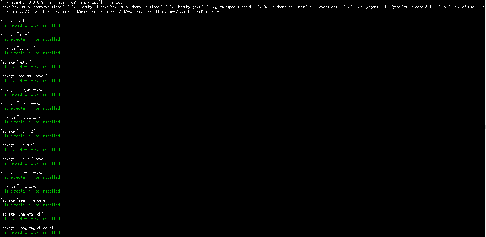
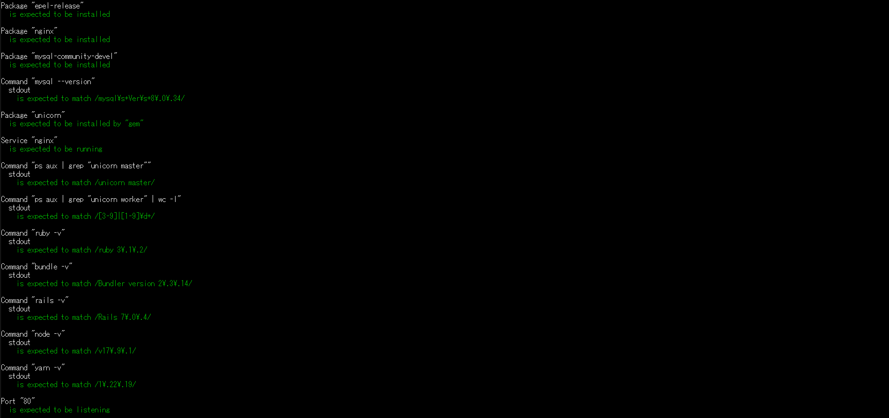

## 第11回追加課題
### テストの実行
**今回実行したテスト内容**
```ruby
require 'spec_helper'

listen_port = 80

# パッケージのインストール確認
%w{
  git make gcc-c++ patch openssl-devel libyaml-devel libffi-devel libicu-devel
  libxml2 libxslt libxml2-devel libxslt-devel zlib-devel readline-devel
  ImageMagick ImageMagick-devel epel-release nginx mysql-community-devel
}.each do |pkg|
  describe package(pkg) do
    it { should be_installed }
  end
end

# Mysqlインストール確認
describe command('mysql --version') do
  its(:stdout) { should match /mysql\s+Ver\s+8\.0\.34/ }
end

# unicornの確認
describe package('unicorn') do
  it { should be_installed.by('gem') }
end

# Nginxの起動状態
describe service('nginx') do
  it { should be_running }
end

#psコマンドを使ってUnicornのプロセスが実行しているかの確認をする
#unicorn master
describe command('ps aux | grep "unicorn master"') do
  its(:stdout) { should match /unicorn master/ }
end

#unicorn worker
describe command('ps aux | grep "unicorn worker" | wc -l') do
  its(:stdout) { should match /[3-9]|[1-9]\d+/ } # 3以上の任意の数
end

# rubyのバージョン確認
describe command('ruby -v') do
  its(:stdout) { should match /ruby 3\.1\.2/ }
end

# bundlerのバージョン確認
describe command('bundle -v') do
  its(:stdout) { should match /Bundler version 2\.3\.14/ }
end

# Railsのバージョン確認
describe command('rails -v') do
  its(:stdout) { should match /Rails 7\.0\.4/ } # ここに期待するバージョンを記述
end

# Nodeのバージョン確認
describe command('node -v') do
  its(:stdout) { should match /v17\.9\.1/ } # ここに期待するバージョンを記述
end

# yarnのバージョン確認
describe command('yarn -v') do
  its(:stdout) { should match /1\.22\.19/ } # ここに期待するバージョンを記述
end

# ポートが開かれているか
describe port(listen_port) do
  it { should be_listening }
end

# 指定されたURLに対してHTTPリクエストを送信し、レスポンスのHTTPステータスコードが200（成功）であることを確認するテスト。レスポンスボディの内容は確認せず、HTTPコードを対象とする。
describe command("curl http://13.231.108.50:#{listen_port}/ -o /dev/null -w '%{http_code}\n' -s") do
  its(:stdout) { should match /^200$/ }
end

describe command("curl http://Lecture10-alb-1385515351.ap-northeast-1.elb.amazonaws.com/ -o /dev/null -w '%{http_code}\n' -s") do
  its(:stdout) { should match /^200$/ }
end

# RDSのサーバー接続確認
describe 'MySQL Command' do
  host = 'lecture10-db.ckqxv4ruunm2.ap-northeast-1.rds.amazonaws.com'
  command_string = "nc -zv #{host} 3306"

  describe command(command_string) do
    its(:exit_status) { should eq 0 }
  end
end

# S3接続確認
describe command("aws s3 ls s3://lecture10s3bk") do
  its(:exit_status) { should eq 0 }
end

```
**test結果**




### 苦労した点
unicornの起動や停止をunicorn.rakeファイルでtask定義していたが、Severspecをアプリケーションルートで設定したためRakefileとの競合や、Rails環境でServerspecが動作しない
などが起こった。rake spec は効くがrake unicorn:stopは効かなかったりその逆が起こり解消するのに苦労した。  
  
**最終的なRakefileのコード**
今回はRails環境においてRakefileを使おうとするとSeverspecが起動しなかったため、回避策としてUnicorn用のタスク内でのみRails環境を読み込むようにしたことで両方動作することができた。
今回はRakefileのタスクがUnicornに関連するもののみのためこのような回避策が使えたが、実際の環境で様々なタスクがある場合、非常に工数がかかりそうなので、テストを動かす別サーバーを用意してsshを使った環境でテストをするのがよいと感じた。

```ruby
require 'rake'
require 'rspec/core/rake_task'

task :spec    => 'spec:all'
task :default => :spec

namespace :spec do
  targets = []
  Dir.glob('./spec/*').each do |dir|
    next unless File.directory?(dir)
    target = File.basename(dir)
    target = "_#{target}" if target == "default"
    targets << target
  end

  task :all     => targets
  task :default => :all

  targets.each do |target|
    original_target = target == "_default" ? target[1..-1] : target
    desc "Run serverspec tests to #{original_target}"
    RSpec::Core::RakeTask.new(target.to_sym) do |t|
      ENV['TARGET_HOST'] = original_target
      t.pattern = "spec/#{original_target}/*_spec.rb"
    end
  end
end

namespace :unicorn do

   # Tasks
   desc "Start unicorn"
   task(:start) {
     require_relative 'config/environment'
     config = Rails.root.join('config', 'unicorn.rb')
     sh "unicorn -c #{config} -E production -D"
   }

   desc "Stop unicorn"
   task(:stop) {
     require_relative 'config/environment'
     unicorn_signal :QUIT
   }

   desc "Restart unicorn with USR2"
   task(:restart) {
     require_relative 'config/environment'
     unicorn_signal :USR2
   }

   desc "Increment number of worker processes"
   task(:increment) {
     require_relative 'config/environment'
     unicorn_signal :TTIN
   }

   desc "Decrement number of worker processes"
   task(:decrement) {
     require_relative 'config/environment'
     unicorn_signal :TTOU
   }

   desc "Unicorn pstree (depends on pstree command)"
   task(:pstree) do
     require_relative 'config/environment'
     sh "pstree '#{unicorn_pid}'"
   end

   # Helpers
   def unicorn_signal signal
     Process.kill signal, unicorn_pid
   end

   def unicorn_pid
     begin
       File.read("/var/www/raisetech-live8-sample-app/tmp/unicorn.pid").to_i
     rescue Errno::ENOENT
       raise "Unicorn does not seem to be running"
     end
   end

end
```


### よく使用されるマッチャー

|NO.| テストケースパターン | 解説 | 使用例 |
|---|----------------------|------|------|
|01| `it { should be_installed }` | 対象がインストールされていることを確認。主にパッケージに対して使用。 |[使用例へジャンプ](#1パッケージのインストール確認) |
|||複数の対象がインストールされていることを一括で確認|[使用例へジャンプ](#1複数のパッケージのインストール確認)|
|02| `it { should be_installed.with_version('1') }` | 対象のパッケージが指定のバージョンでインストールされていることを確認。 |[使用例へジャンプ](#2指定のバージョンのパッケージのインストール確認)|
|03| `it { should be_installed.by('gem').with_version('1.10.5') }` | gemとして指定のバージョンがインストールされていることを確認。 |[使用例へジャンプ](#3gemとして指定のバージョンがインストールされているか確認)|
|04| `it { should be_enabled }` | 対象のサービスが自動起動設定されていることを確認。 |[使用例へジャンプ](#4指定のサービスの状態確認)|
|05| `it { should be_listening }` | 対象のポートがリッスン状態であることを確認。 |[使用例へジャンプ](#5指定のポートの状態確認)|
|06| `it { should be_reachable }` | 対象のホストやポートが到達可能であることを確認。 |[使用例へジャンプ](#6ホストの到達可能性確認)|
|07| `it { should exist }` | 対象のファイルやディレクトリ、ユーザー、グループなどが存在することを確認。 |[使用例へジャンプ](#7グループの存在確認)|
|08| `it { should belong_to_group 'group_name' }` | 対象のユーザーが指定のグループに所属していることを確認。 |[使用例へジャンプ](#8ユーザのグループ所属確認)|
|09| `it { should have_uid 403 }` | 対象のユーザーが指定のUIDを持っていることを確認。 |[使用例へジャンプ](#9ユーザのuid確認)|
|10| `it { should be_directory }` | 対象がディレクトリであることを確認。 |[使用例へジャンプ](#10ディレクトリの存在確認)|
|11| `it { should be_mode 755 }` | 対象のファイルやディレクトリのパーミッションが755であることを確認。 |[使用例へジャンプ](#11ファイルのパーミッション確認)|
|12| `it { should be_readable.by_user('user_name') }` | 対象のファイルに指定のユーザーが読み込み権限を持っていることを確認。 |[使用例へジャンプ](#12ファイルの読み込み権限確認)|
|13| `its(:content) { should match /parameter=value/ }` | 対象のファイルの内容が指定した正規表現にマッチすることを確認。 |[使用例へジャンプ](#13ファイルの内容確認)|
||| curlでHTTPアクセスして200 OKが返ってくるか確認 |[使用例へジャンプ](#13httpアクセスのレスポンス確認)|
|14| `its(:stdout) { should match /^200$/ }` | コマンドの標準出力が指定した正規表現にマッチすることを確認。 |[使用例へジャンプ](#14コマンドの標準出力確認)|
|15| `its(:exit_status) { should eq 0 }` | コマンドの終了ステータスが0（成功）であることを確認。 |[使用例へジャンプ](#15コマンドのリターンコード確認)|
|16| `it { should_not be_running }` | 対象のサービスやプロセスが実行中でないことを確認。 |[使用例へジャンプ](#16サービスの実行状態確認)|
|17| `it { should be_resolvable.by('hosts') }` | 対象のホスト名が名前解決できることを確認。 |[使用例へジャンプ](#17名前解決確認)|
|18| `it { should be_installed.by(:gem) }` | fluentプラグインなど組込gemとしてインストールされていることを確認。 |[使用例へジャンプ](#18fluentプラグインのインストール確認)|
|19| `let(:disable_sudo) { true }` | sudoせずにコマンドを実行する。 |[使用例へジャンプ](#19sudoせずにコマンド実行確認)|
|20| `let(:sudo_options) { '-u user01 -i' }` | sudoするユーザーを指定する。 |[使用例へジャンプ](#20sudoするユーザ指定)|
|21| `if os[:family] == 'amazon'` | Amazon Linuxかどうかを判定する。 |[使用例へジャンプ](#21amazonlinux判定)|
|22| `include_examples 'commons'` | 共通のテストケースを含む。 |[使用例へジャンプ](#22テストケースの共有)|

### 使用例と解説
#### 1.パッケージのインストール確認
```ruby
describe package('nginx') do
  it { should be_installed }
end
```
`nginx`という名前のパッケージがシステムにインストールされているかを検証する。`should be_installed`は、指定されたパッケージがインストールされていることを期待する。

#### 1.複数のパッケージのインストール確認
```ruby
%w{autoconf bison flex gcc gcc-c++ kernel-devel make m4}.each do |pkg|
  describe package(pkg) do
    it { should be_installed }
  end
end
```
配列内の各パッケージがインストールされているかを一括で確認。`%w{}` は Ruby において、文字列の配列を簡潔に作成するためのリテラルであり、各文字列をスペースで区切るだけで配列の要素として認識される。`.each`メソッドで配列の各要素に対してブロック内のテストが実行される。

#### 2.指定のバージョンのパッケージのインストール確認
```ruby
describe package('nginx') do
  it { should be_installed.with_version('1.21.1') }
end
```
`nginx`ウェブサーバーがバージョン`1.21.1`でインストールされているかを検証。`.with_version('1.21.1')`で、期待するバージョンを指定する。


#### 3.gemとして指定のバージョンがインストール確認
```ruby
describe package('bundler') do
  it { should be_installed.by('gem').with_version('1.10.5') }
end
```
`bundler`というgemがバージョン`1.10.5`でインストールされているかを検証。`.by('gem')`で、パッケージ管理システムとしてgemを指定する。


#### 4.指定のサービスの状態確認
```ruby
describe service('httpd') do
  it { should be_enabled }
  it { should be_running }
end
```
`httpd`サービス（Apache HTTP Server）が有効化（自動起動設定）されており、かつ、現在実行中であるかを検証する。`httpd`はウェブサーバーとして広く利用されており、ウェブページのホスティングに使われる。ウェブサーバーが正常に動作しているか、システム起動時に自動的に起動する設定になっているかを確認できる。

#### 5.指定のポートの状態確認
```ruby
describe port("8080") do
  it { should be_listening }
end
```
ポート`8080`がリッスン状態であるかを検証。リッスン状態であることは、サービスがそのポートで接続を待ち受けていることを意味する。

#### 6.ホストの到達可能性確認
```ruby
describe host('www.example.com') do
  it { should be_reachable }
end
```
`www.example.com`というホストがネットワーク上で到達可能であるかを検証。到達可能であることは、ネットワーク的に接続可能であること。

#### 7.グループの存在確認
```ruby
Copy code
describe group('ec2-user') do
  it { should exist }
end
```
ec2-userという名前のグループがシステムに存在するかを検証。`should exist`マッチャを使用して、指定されたグループ名がシステムのグループとして存在しているかを確認。これにより、システムに必要なグループが正しく設定されているか、セキュリティの設定が適切であるかなどを検証できる。

#### 8.ユーザのグループ所属確認
```ruby
describe user('ec2-user') do
  it { should belong_to_group 'ec2-user' }
end
```
`ec2-user`という名前のユーザーが、`ec2-user`という名前のグループに所属しているかを検証する。`belong_to_group`マッチャを使用して、ユーザーが特定のグループに所属していることを確認。

#### 9.ユーザのUID確認
```ruby
describe user('ec2-user') do
  it { should have_uid 65534 }
end
```
`ec2-user`という名前のユーザーがUID（User Identifier）`65534`を持っているかを検証。UIDは、システム内でユーザーを一意に識別するための番号です。`have_uid`マッチャを使用して、ユーザーが特定のUIDを持っていることを確認。

#### 10.ディレクトリの存在確認
```ruby
describe file('/var/log') do
  it { should be_directory }
end
```
`/var/log`がディレクトリであるかを検証する。`be_directory`マッチャを使用して、指定されたパスがディレクトリであることを確認し、これによりログファイルなどが正しい場所に保存されているかを検証できる。

#### 11.ファイルのパーミッション確認
```ruby
describe file('/etc/passwd') do
  it { should be_mode 755 }
end
```
`/etc/passwd`ファイルのパーミッションが`755`であるかを検証します。`be_mode`マッチャを使用して、ファイルのパーミッションが正しいかを確認。`755`は、オーナーには読み書き実行の権限があり、他のユーザーには読み取りと実行の権限があること。

#### 12.ファイルの読み込み権限確認
```ruby
describe file('/etc/shadow') do
  it { should be_readable.by_user('root') }
end
```
`/etc/shadow`ファイルが`root`ユーザーによって読み込み可能であるかを検証する。`be_readable.by_user`マッチャを使用して、特定のユーザーがファイルを読み込む権限を持っているかを確認。`/etc/shadow`ファイルは、システムのユーザーパスワードを格納するため、セキュリティが重要。

#### 13.ファイルの内容確認
```ruby
describe file('/etc/sysconfig/clock') do
  its(:content) { should match /ZONE="Asia\/Tokyo"/ }
end
```
`/etc/sysconfig/clock`ファイルの内容が`ZONE="Asia/Tokyo"`という文字列を含むかを検証。`its(:content)`を使用してファイルの内容を取得し、`match`マッチャで特定の文字列が含まれているかを確認します。これにより、システムのタイムゾーン設定が正しいかを検証している。

#### 13.HTTPアクセスのレスポンス確認
```ruby
describe command('curl http://127.0.0.1:9200/_plugin/head/ -o /dev/null -w "%{http_code}\n" -s') do
  its(:stdout) { should match /^200$/ }
end
```
curlコマンドを使用してHTTPアクセスし、200 OKが返ってくるかを検証。`its(:stdout)`を使用してコマンドの標準出力を取得し、`match`マッチャでHTTPステータスコード200が返ってきているかを確認。これにより、Webサービスが正常に動作しているかを検証できる。

#### 14.コマンドの標準出力確認
```ruby
describe command('ruby -v') do
  its(:stdout) { should match /ruby 2\.1\.4/ }
end
```
`ruby -v`コマンドの標準出力が`ruby 2.1.4`を含むかを検証。`its(:stdout)`を使用してコマンドの標準出力を取得し、`match`マッチャで特定のバージョン情報が含まれているかを確認。これにより、システムにインストールされているRubyのバージョンが正しいかを検証できる。

#### 15.コマンドのリターンコード確認
```ruby
describe command('which mysql') do
  its(:exit_status) { should eq 0 }
end
```
`which mysql`コマンドの終了ステータスが`0`（成功）であるかを検証。`its(:exit_status)`を使用してコマンドの終了ステータスを取得し、`eq`マッチャで終了ステータスが0であるかを確認。これにより、mysqlコマンドがシステムパスに存在するかを検証できる。

#### 16.サービスの実行状態確認
```ruby
describe service('nginx') do
  it { should_not be_running }
end
```
`nginx`サービスが実行中でないことを検証。`should_not be_running`を使用して、サービスが実行中でないことを確認。これにより、nginxサービスの実行状態を管理できる。

#### 17.名前解決確認
```ruby
describe host('example') do
  it { should be_resolvable.by('hosts') }
end
```
`example`ホスト名が`hosts`ファイルによって名前解決できるかを検証。`be_resolvable.by('hosts')`を使用して、ホスト名がhostsファイルによって解決できるかを確認。これにより、ネットワークの名前解決設定が正しいかを検証できる。

#### 18.fluentプラグインのインストール確認
```ruby
plugins = %w{config-expander datacounter numeric-counter zabbix forest}
plugins.each do |plugin|
  describe package("fluent-plugin-#{plugin}") do
    let(:path) { '/usr/lib64/fluent/ruby/bin:$PATH' }
    it { should be_installed.by(:gem) }
  end
end
```
リスト内の各fluentプラグインがgemとしてインストールされているかを検証。`should be_installed.by(:gem)`を使用して、各プラグインがRubyのgemとしてシステムにインストールされているかを確認。これにより、fluentdのプラグインが正しくインストールされているかを検証できる。

#### 19.sudoせずにコマンド実行確認
```ruby
describe command('whoami') do
  let(:disable_sudo) { true }
  its(:stdout) { should match /#{ENV['USER']}/ }
end
```
sudoせずに`whoami`コマンドを実行し、標準出力が現在のユーザー名を含むかを検証する。`let(:disable_sudo) { true }`を使用してsudoを無効化し、`its(:stdout)`と`match`マッチャを使用して標準出力が期待するユーザー名を含むかを確認。これにより、特定のコマンドがsudoなしで正しく実行できるかを検証できる。

#### 20.sudoするユーザ指定
```ruby
describe command('whoami') do
  let(:sudo_options) { '-u user01 -i' }
  its(:stdout) { should match /user01/ }
end
```
`user01`ユーザーとして`whoami`コマンドを実行し、標準出力が`user01`を含むかを検証。`let(:sudo_options) { '-u user01 -i' }`を使用してsudoのオプションを指定し、`its(:stdout)`と`match`マッチャを使用して標準出力が期待するユーザー名を含むかを確認。これにより、特定のユーザーとしてコマンドが正しく実行できるかを検証できる。

#### 21.AmazonLinux判定
```ruby
if os[:family] == 'amazon'
  describe package('aws-cli') do
    it { should be_installed }
  end
end
```
OSがAmazon Linuxの場合に、`aws-cli`パッケージがインストールされているかを検証。`if os[:family] == 'amazon'`を使用してOSの種類を判定し、`should be_installed`を使用して`aws-cli`パッケージがインストールされているかを確認。これにより、特定のOSで特定のパッケージがインストールされているかを検証できる。

#### 22.テストケースの共有
```ruby
require 'spec_helper'
include_examples 'commons'
```
共通のテストケースを含みます。`include_examples 'commons'`を使用して、他のテストファイルで定義された共通のテストケースを読み込む。これにより、複数のサーバ種別で共通するテストケースを一元管理でき、コードの再利用性が向上する。