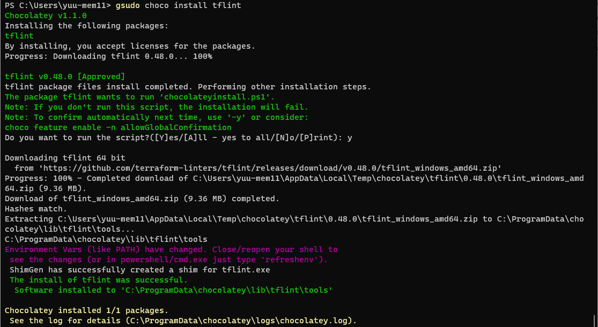
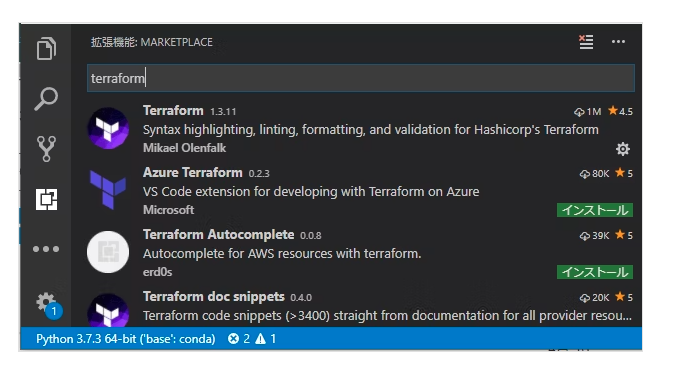
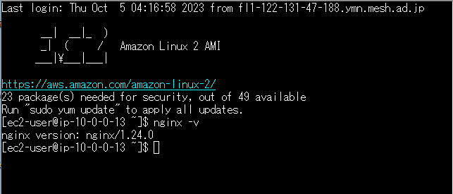

## AWSコース第13回課題「CircleCIにAnsilbleやServerSpecの処理を追加」

### terraformで環境構築
**terraformのインストール**
chocolateyを使用してインストール実施




**terraform拡張機能インストール**


**terraformメモ**
- 環境ごとに構築する場合
    - 環境ごとのディレクトリにそれぞれmain.tfを作成
    - 環境のカレントディレクトリでterraform init
    - planでチェック、applyで構築、destroyで消去
- モジュール間でリソースや変数を使いたい場合の方法
    - ルートのmain.tfでモジュールを参照する際は、モジュールのパス
    - モジュール内で他のモジュールのリソースや変数を参照する場合outputs.tfに定義
    - 他のモジュールのoutputsを受け取る側はvariables.tfに変数として定義
    - ルートのmain.tfでモジュールを呼ぶ際に、他のモジュールのアウトプットを変数に渡す
- CloudFormationでセキュリティグループのegressで指定したDestinationSecurityGroupIdはなく、source_security_group_idを使う
- AWSのアクセスキーやシークレットキーはデフォルトで読み取る環境変数名で設定すれば、明示的に書かなくても読み取る
- tfstateにリソースの状態を保存する。S3で管理できる。Dynamodbを利用して複数人環境で同時変更を防ぐロック機構を導入できる
    - 今回はCircleCIで利用するためにtfstateをS3に保存するが、ロック機構は作成しない
- backendの設定によりS3に保存したstateをinitで取り込むことによって異なる環境でも状態を共有できる
    - ローカルでapplyした場合とCircleCIでapplyした場合で差異がないように整合性を保てる
- アウトバウンドルールを明記しないとアウトバウンドルールが全拒否になる

**CircleCIメモ**
- terraformを動かすためterraformをインストールした環境をDockerで作成してコマンドを実行する
    - ```image: hashicorp/terraform:1.5.7```が使用可能
- AWSのアクセスキーやシークレットキーは設定の環境変数に設定
- terraformの変更とそれ以外の変更をした際でCircleCIの実行ワークフローを分岐するためにDynamicConfigを利用
    - [公式](https://circleci.com/docs/ja/using-dynamic-configuration/)
    - これにより無駄にterraformが実行されるのを回避でき、複数の環境を同じリポジトリで管理可能となる
    - Project settings > Advanced -> Dynamic config using setup workflowsで設定の変更をしないと使えないので注意
    - configファイルを分けて、動的にワークフローを作成できる  
        **実装例**
        **.circleci/config.yml**
        ```yaml
        version: 2.1

        # this allows you to use CircleCI's dynamic configuration feature
        setup: true

        # the path-filtering orb is required to continue a pipeline based on
        # the path of an updated fileset
        orbs:
        path-filtering: circleci/path-filtering@1.0.0

        workflows:
        # the always-run workflow is always triggered, regardless of the pipeline parameters.
        always-run:
            jobs:
            # the path-filtering/filter job determines which pipeline
            - path-filtering/filter:
                name: check-updated-files
                # 3-column, whitespace-delimited mapping. One mapping per
                # line:
                # <regex path-to-test> <parameter-to-set> <value-of-pipeline-parameter>
                mapping: |
                    terraform/environments/development/.* run-development-terraform-build true
                    terraform/modules/.* run-modules-terraform-build true
                    ^((?!terraform/).)*$ run-raisetech-sample-config true
                base-revision: lecture13
                # this is the path of the configuration we should trigger once
                # path filtering and pipeline parameter value updates are
                # complete. In this case, we are using the parent dynamic
                # configuration itself.
                config-path: .circleci/terraform_config.yml
        ```
        **.circleci/terraform_config.yml**
        ```yml

        version: 2.1           

        orbs:
        python: circleci/python@2.0.3

        parameters:
        run-development-terraform-build:
            type: boolean
            default: false
        run-modules-terraform-build:
            type: boolean
            default: false
        run-raisetech-sample-config:
            type: boolean
            default: false     

        executors:
        terraform:
            docker:
            - image: hashicorp/terraform:1.5.7

        jobs:
        plan:
            executor: terraform
            steps:
            - checkout
            - run:
                name: Terraform Plan
                command: |
                    cd ./terraform/environments/development
                    terraform init
                    terraform plan

        apply:
            executor: terraform
            steps:
            - checkout
            - run:
                name: Terraform Apply
                command: |
                    cd ./terraform/environments/development
                    terraform init
                    terraform apply -auto-approve
        
        cfn-lint:
            executor: python/default
            steps:
            - checkout
            - run: pip install cfn-lint
            - run:
                name: run cfn-lint
                command: |
                    cfn-lint -i W3002 -t cloudformation/*.yml

        workflows:
        # when pipeline parameter, run-development-terraform-build is true, the
        # job is triggered.
        develop-terraform-build:
            when: 
            or: [<< pipeline.parameters.run-development-terraform-build >>, << pipeline.parameters.run-modules-terraform-build >>]
            jobs:
            - plan          
            - apply:
                requires:
                    - plan

        # when pipeline parameter, run-raisetech-sample-config is true, the
        # job is triggered.
        sample-jobs:
            when: << pipeline.parameters.run-raisetech-sample-config >>
            jobs:
            - cfn-lint
        ```    

### コンテナによるAnsilble実行環境の構築
**Docker for windowsを使用する**
- Docker for windowsのインストール～AnsibleでHelloworldを表示する
    ```
    # AmazonLinuxのImageを取得
    docker pull amazonlinux 

    # コンテナを作成＋ローカル環境のAnsible用ディレクトリをマウント
    docker run -it --name ansible_container -v C:/Users/<user-name>/<project-name>/ansible:/ansible amazonlinux /bin/bash

    # 環境アップデートとPythonインストール、ansibleインストール
    yum update -y
    yum install -y python3 python3-pip
    pip3 install ansible

    # ansibleバージョン確認
    ansible --version

    # sshkeyを生成
    yum install -y openssh-clients
    ssh-keygen

    # ansibleを試しに実行=>環境内にHelloworldを表示するだけ
    ansible-playbook ./ansible/playbooks/playbook.yml

    # 表示結果
    [WARNING]: No inventory was parsed, only implicit localhost is available
    [WARNING]: provided hosts list is empty, only localhost is available. Note that the implicit localhost does not match
    'all'

    PLAY [Hello World Playbook] ********************************************************************************************

    TASK [Gathering Facts] *************************************************************************************************
    ok: [localhost]

    TASK [Print Hello, World!] *********************************************************************************************
    ok: [localhost] => {
        "msg": "Hello, World!"
    }

    PLAY RECAP *************************************************************************************************************
    localhost                  : ok=2    changed=0    unreachable=0    failed=0    skipped=0    rescued=0    ignored=0
    ```

- AnsibleでEC2内部にNginxをインストールしてみる
    - 外部から接続用のhosts設定を追加
        **ansible/inventories/development/hosts**
        ```
        [webserver]
        <EC2 public ip> ansible_ssh_user=ec2-user ansible_ssh_private_key_file=/tmp/<EC2piarkey>.pem
        ```
          

     - Dockerコンテナ内にPemKeyがなかったため外部からDockerへコピー(操作はDocker外部から行う) ～Playbook実行   
        ```
        # コンテナIDの確認
        docker ps
        
        #ローカルからDockerコンテナ内にKeyをコピー(永続化していなければDockerコンテナを終了するとコンテナ内のデータは消去される) 
        docker cp /path/to/your_private_key.pem your_container_id_or_name:/path/in/container/your_key.pem
        # 立ち上げ時にマウントしていたら上記操作は不要となる

        # Keyの権限を適正化(755など適正でない権限のKeyはブロックされることがある)
        chmod 0600 /tmp/RaisetechEC2KeyPair.pem

        # Playbookの実行
        ansible-playbook -i <path to hosts> ./ansible/playbooks/playbook.yml

        # 実行結果
        bash-5.2# ansible-playbook -i /ansible/inventories/development/hosts /ansible/playbooks/playbook.yml

        PLAY [Install Nginx] ***************************************************************************************************

        TASK [Gathering Facts] *************************************************************************************************
        [WARNING]: Platform linux on host 13.231.107.81 is using the discovered Python interpreter at /usr/bin/python3.7, but
        future installation of another Python interpreter could change the meaning of that path. See
        https://docs.ansible.com/ansible-core/2.15/reference_appendices/interpreter_discovery.html for more information.
        ok: [13.231.107.81]

        TASK [Install Nginx repository] ****************************************************************************************
        changed: [13.231.107.81]

        TASK [Install Nginx] ***************************************************************************************************
        changed: [13.231.107.81]

        PLAY RECAP *************************************************************************************************************
        13.231.107.81              : ok=3    changed=2    unreachable=0    failed=0    skipped=0    rescued=0    ignored=0
        ```
        

Dockerにした変更メモ
docker cp C:/Users/<user-name>/.aws <dockerID>:/root/
bash-5.2# curl -O https://releases.hashicorp.com/terraform/1.1.0/terraform_1.1.0_linux_amd64.zip
bash-5.2# yum install unzip -y
bash-5.2# unzip terraform_1.1.0_linux_amd64.zip
bash-5.2# mv terraform /usr/local/bin/
bash-5.2# terraform version
Terraform v1.1.0
bash-5.2# pip3 install boto3 botocore


