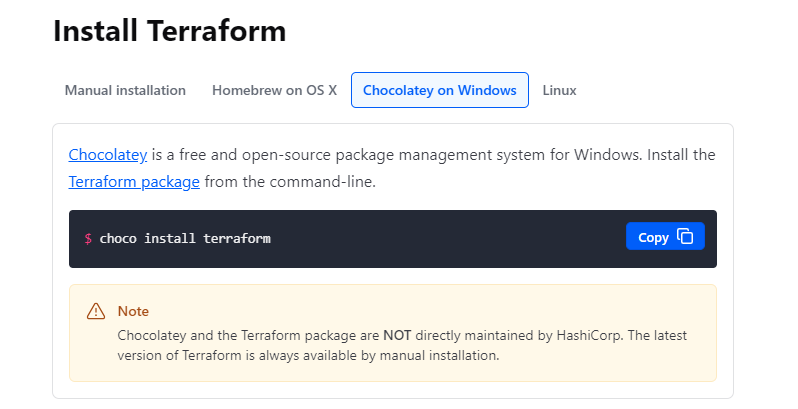

## AWSコース第13回課題「CircleCIにAnsilbleやServerSpecの処理を追加」

### terraformで環境構築
**terraformのインストール**
chocolateyを使用してインストール実施

**terraform拡張機能インストール**

**terraformメモ**
- 環境ごとに構築する場合
    - 環境ごとのディレクトリにそれぞれmain.tfを作成
    - 環境のカレントディレクトリでterraform init
    - planでチェック、applyで構築、destroyで消去
- モジュール間でリソースや変数を使いたい場合の方法
    - ルートのmain.tfでモジュールを参照する際は、モジュールのパス
    - モジュール内で他のモジュールのリソースや変数を参照する場合outputs.tfに定義
    - 他のモジュールのoutputsを受け取る側はvariables.tfに変数として定義
    - ルートのmain.tfでモジュールを呼ぶ際に、他のモジュールのアウトプットを変数に渡す
- CloudFormationでセキュリティグループのegressで指定したDestinationSecurityGroupIdはなく、source_security_group_idを使う
- AWSのアクセスキーやシークレットキーはデフォルトで読み取る環境変数名で設定すれば、明示的に書かなくても読み取る
### コンテナによるAnsilble実行環境の構築
**Docker for windowsを使用する**

‐ Docker for windowsのインストール
    
